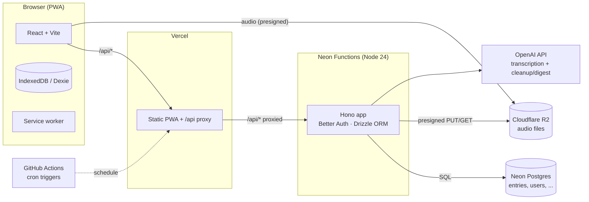
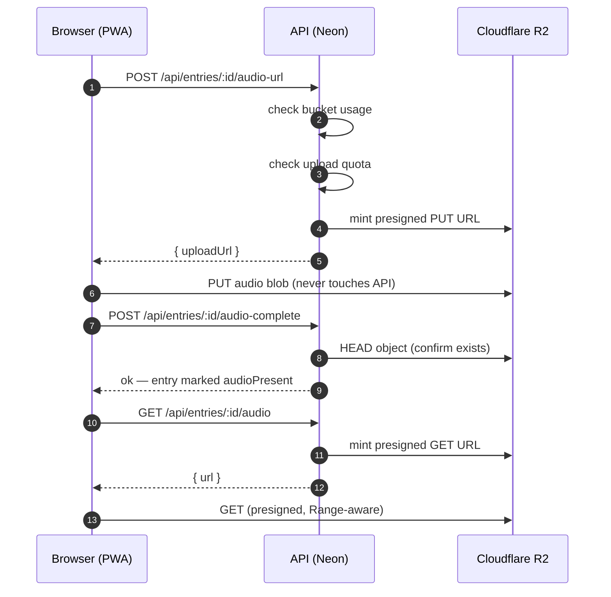

# Willow — Architecture

Voice-first journaling PWA. You ramble at the end of the day; Willow transcribes,
cleans, and stores it as a journal entry — with streaks, mood tracking, prompts,
and a weekly AI digest.

This document explains how the system fits together: the client, the API, the
data stores, and how they're deployed on free tiers (hosting and infrastructure
only — OpenAI usage stays metered pay-per-token).

---

## 1. Big picture



| Piece | Host | Role |
|---|---|---|
| Frontend | **Vercel** (static) | Serves the built PWA; rewrites `/api/*` to Neon so the browser never needs CORS |
| API | **Neon Functions** | Long-running Node 24 serverless; runs the Hono app next to Postgres |
| Database | **Neon Postgres** | All relational data; free tier = 100 CU-hrs + 0.5 GB, scale-to-zero after 5 min idle |
| Audio | **Cloudflare R2** | WebM recordings; free tier = 10 GB + 1M/10M ops, zero egress |
| Cron | **GitHub Actions** | Timezone-aware scheduled jobs that hit `/api/cron/*` |
| AI | **OpenAI** | Transcription, cleanup, prompts, weekly digest (server-side only) |

### Why this split (and what changed)

Willow used to be a single Node container: Hono + SQLite (`better-sqlite3`) +
audio on disk + in-process `node-cron`. That's a great MVP shape, but it needs a
persistent VPS. This migration moves each concern to a free tier:

- **SQLite → Neon Postgres**: same Drizzle schema language, new driver
  (`drizzle-orm/node-postgres` + `pg`). All queries are unchanged in shape;
  the only schema deltas are Postgres-native types (`timestamp`, `jsonb`,
  `bigint`).
- **Disk audio → R2 presigned URLs**: the browser never sends audio through the
  API. It asks the API for a short-lived R2 PUT URL, uploads straight to R2, and
  later mints a 1-hour GET URL for playback.
- **`node-cron` → GitHub Actions**: Neon Functions are request-driven — they
  can't hold a background scheduler. The three jobs became authenticated
  endpoints (`/api/cron/{reminder,digest,retention}`) triggered by a scheduled
  GitHub Actions workflow.
- **Same-origin → cross-origin auth**: the frontend and API are different
  origins now, so Better Auth uses a custom cookie prefix + secure cookies, and
  the Vercel proxy keeps browser requests same-origin anyway (the proxy forwards
  `Origin`/cookies untouched, so the auth cookie works as before).

---

## 2. Data model (Postgres)

All tables are defined in `apps/api/src/db/schema.ts` and applied via Drizzle
migrations in `apps/api/drizzle/` (applied automatically at function boot —
see "Deploy" below).

| Table | Purpose | Key columns |
|---|---|---|
| `user` / `session` / `account` / `verification` | Better Auth (email/password) | standard Better Auth shape |
| `entries` | Journal entries, synced from the client | `user_id`, `recorded_at`, `audio_present`, `raw_transcript`, `cleaned_body`, `mood`, `tags` (jsonb), `updated_at_epoch_ms` (bigint) |
| `prompts` | Per-user, per-day cached AI prompts | `user_id`, `date` (YYYY-MM-DD), `questions` (jsonb), unique `(user_id, date)` |
| `push_subscriptions` | Web Push subscriptions | `user_id`, `endpoint` (unique per user), `keys` (jsonb) |
| `audio_uploads` | Upload-quota audit (free-tier abuse gate) | `user_id`, `created_at` |

### Free-tier guardrails (why some columns exist)

- **`audio_uploads`** backs the **50 uploads/user/day** cap. Each minted upload
  URL reserves a slot inside a transaction (serialized per user, so concurrent
  requests can't bypass the cap); slots are released if minting fails. This
  caps both Class A operations *and* storage growth from a single abusive
  account.
- **`R2_STORAGE_LIMIT_BYTES`** (env, default 9.9 GB) is checked against the R2
  bucket's live usage before minting any upload URL. At 9.9 GB the app stops
  accepting new recordings — **you can never exceed the 10 GB free tier**.

---

## 3. The audio flow (R2 presigned URLs)



- Upload URLs: **1-hour expiry**, `Content-Type: audio/webm` pinned in the
  signature (browser must send the same header or R2 rejects with 403), and a
  signed `Content-Length` cap (`MAX_AUDIO_UPLOAD_BYTES`) so oversized uploads
  fail at R2 without reaching storage.
- An entry is only marked `audioPresent` by `POST /:id/audio-complete` after
  the server confirms the object exists (HEAD) — a failed/cancelled PUT never
  leaves the entry claiming audio it doesn't have.
- Playback URLs: **1-hour expiry** — short so a leaked URL can't be hammered
  for a month of Class B reads.
- Audio object keys are `audio/{userId}/{entryId}.webm` — user-scoped, so even
  with a valid URL you can't reach another user's file (the API only mints URLs
  for entries the session user owns).
- Deleting an entry calls `DELETE /api/entries/:id/audio`, which removes the
  R2 object and flips `audio_present` back to `false`.

### Range requests & seeking

The old disk-backed endpoint streamed 206 Partial Content for seeking. R2's
presigned GET URLs support `Range` natively (the AWS SigV4 signature covers the
`Range` header), so the browser `<audio>` element seeks without any API
involvement.

---

## 4. Sync model (offline-first)

- The client stores entries in **IndexedDB** (Dexie) — `apps/web/src/lib/db.ts`.
- `apps/web/src/lib/sync.ts` runs a sync engine on load/reconnect/visibility:
  1. **Push** dirty entries via `POST /api/entries/sync` (last-write-wins on
     `updatedAt`).
  2. **Pull** remote changes since `lastSync` via
     `GET /api/entries/sync?since=...`.
  3. **Upload audio**: for entries with a local blob but no server copy, mint an
     R2 PUT URL and upload.
- `recordedAt`/`updatedAt` are ISO strings; the API converts to Postgres
  timestamps and back. `updatedAtEpochMs` (bigint) is kept for client sort
  stability across devices.

---

## 5. Authentication (Better Auth, cross-origin)

- Server: `apps/api/src/auth.ts` — `betterAuth` with the Drizzle Postgres
  adapter, email/password only.
- Client: `apps/web/src/lib/auth.tsx` — `createAuthClient()`; in production the
  Vercel proxy keeps `/api/auth/*` same-origin, so cookies flow normally.
- Cookie: `willow.session_token` (custom prefix), `Secure`, works cross-site via
  `advanced.crossSubDomain`.
- `PUBLIC_ORIGIN` (the Vercel URL) must be set in the function env — it drives
  Better Auth's `baseURL` + trusted origins and the Hono CORS allowlist. Without
  it, sign-out and cookie refresh fail with `INVALID_ORIGIN`.

### Data isolation

Every user-scoped endpoint filters by the session user's id
(`getSessionUser(c)` → `eq(entries.userId, user.id)`). The only unscoped paths
are `/api/cron/*`, which require `Authorization: Bearer $CRON_SECRET` and are
admin jobs that operate across all users by design (send pushes, prune audio).

---

## 6. Scheduled jobs

`.github/workflows/cron.yml` — three jobs, each `curl`s the Neon function:

| Job | Schedule (Asia/Kolkata, editable) | Endpoint | What it does |
|---|---|---|---|
| Evening reminder | daily `30 18 * * *` | `POST /api/cron/reminder` | Push to users with no entry today, with the day's prompt question |
| Weekly digest | Sunday `0 19 * * 0` | `POST /api/cron/digest` | Push a "week in review" notification |
| Audio retention | nightly `30 4 * * *` | `POST /api/cron/retention` | Delete R2 audio older than `SERVER_AUDIO_RETENTION_DAYS` |

Secrets: `WILLOW_CRON_SECRET` (repo secret), `WILLOW_API_URL` (repo variable =
the function's invocation URL). Each job has an `if` condition matching its own
schedule tick, so a schedule event only triggers the matching job (manual
`workflow_dispatch` runs trigger all three). The endpoints are idempotent and
cheap, so manual runs are safe for testing.

The reminder computes "today" in `CRON_TIMEZONE` (default Asia/Kolkata) so the
day boundary matches the workflow schedule.

Note: GitHub Actions fires scheduled jobs **within ±~30 min** of the cron time,
not exactly on it — fine for a journaling nudge.

---

## 7. Deployment

### Neon Functions (the API)

The Neon CLI's `neon functions deploy --src` only ships the esbuild output —
**not** sibling folders — so the Drizzle `drizzle/` migrations folder would be
missing at runtime. `apps/api/scripts/neon-deploy.mjs` handles this:

1. `tsc` build + esbuild bundle (`dist/function.mjs`) — everything inlined
   except `pg-native` (aliased to a stub; it's an unused optional native dep of
   `pg`).
2. Packages `index.mjs` + `drizzle/` into `function.zip`.
3. POSTs to the Neon deploy API with the full env as JSON.

On boot the function runs `migrate()` — Drizzle's journal-based migrator,
tracking applied migrations in `drizzle.__drizzle_migrations`, so every cold
start is safe and later migrations apply exactly once. For databases created
before this tracking existed (e.g. via `drizzle-kit push`), the bootstrap
one-time-reconciles the journal into the tracking table so existing schemas
are treated as already migrated.

In CI, `.github/workflows/deploy.yml` runs this on every push to `main`:

```bash
node apps/api/scripts/neon-deploy.mjs   # env comes from CI secrets/vars
```

### Vercel (the frontend)

Deployed by the same `deploy.yml` pipeline (`vercel pull` → `vercel build
--prod` → `vercel deploy --prebuilt --prod`), or manually:

```bash
cd apps/web
vercel link --yes --project willow
vercel build --prod --yes     # builds locally (workspace-aware)
vercel deploy --prebuilt --prod --yes
```

`apps/web/vercel.json`:
- serves `index.html` for all non-API routes (SPA fallback),
- disables caching on `sw.js` so PWA updates propagate.

`apps/web/middleware.ts` (Vercel Routing Middleware, Edge runtime) proxies
`/api/*` to the Neon function URL from the `WILLOW_API_URL` env var — the
function URL stays out of the repo. Set it in the Vercel project settings:

### R2 (audio)

- Bucket: `willow-audio` (created via `wrangler r2 bucket create`).
- CORS policy allows `GET`/`PUT`/`HEAD` from the Vercel origin + localhost.
- Credentials: an R2 API token ("Object Read & Write") for the S3 client, plus
  a Cloudflare API token (R2 read) for the usage gate.

---

## 8. Environment variables

See the single root `.env.example` for the annotated list (one file for every
service). The critical ones:

| Var | Required | Notes |
|---|---|---|
| `DATABASE_URL` | yes | Injected by Neon on Functions; `neon env pull` locally |
| `OPENAI_API_KEY` | yes | Transcription + cleanup + prompts + digest |
| `R2_ACCOUNT_ID` / `R2_ACCESS_KEY_ID` / `R2_SECRET_ACCESS_KEY` | yes | R2 S3 creds for presigned URLs |
| `R2_API_TOKEN` | yes | Cloudflare API token (R2 read) for the 9.9 GB gate |
| `CRON_SECRET` | yes | Shared with GitHub Actions |
| `AUTH_SECRET` | yes | Better Auth session secret |
| `PUBLIC_ORIGIN` | yes in prod | Vercel URL; drives auth + CORS |
| `VAPID_*` | for push | Web Push keys |
| `R2_STORAGE_LIMIT_BYTES` | no | Default 9.9 GB |
| `MAX_UPLOADS_PER_USER_PER_DAY` | no | Default 50 |

---

## 9. Cost ceiling (why you can't get a surprise bill)

| Service | Free tier | Protection |
|---|---|---|
| Neon Postgres | 100 CU-hrs/mo, 0.5 GB | **Hard stop**: compute suspends at quota; 0.25 CU min pinned |
| Vercel | Static hosting | No serverless functions used (prebuilt deploy), so no usage billing |
| Cloudflare R2 | 10 GB, 1M Class A, 10M Class B | **App gate**: uploads rejected at 9.9 GB; 50/day/user cap |
| GitHub Actions | 2000 min/mo (private) | ~45 min/mo used by 3 daily jobs |
| OpenAI | pay-per-token | ~$1/mo for a daily 5-min ramble (`gpt-4o-mini-transcribe`) |

The only variable cost is OpenAI usage. Everything else is either hard-stopped
by the platform (Neon) or gated in-app (R2).
