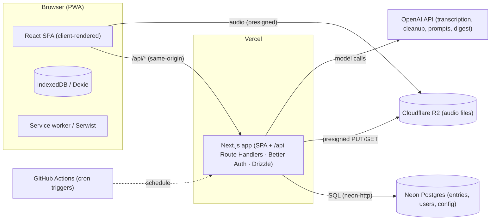
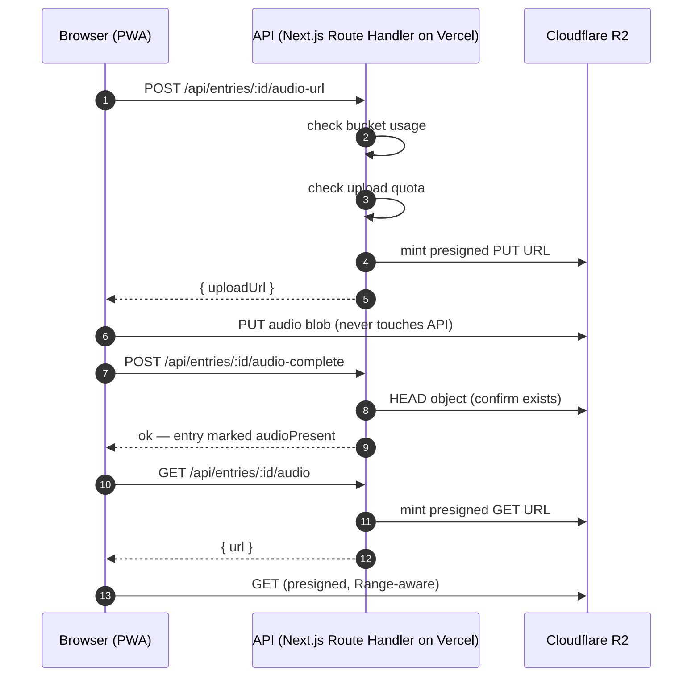

# Willow — Architecture

Voice-first journaling PWA. You ramble at the end of the day; Willow transcribes,
cleans, and stores it as a journal entry — with streaks, mood tracking, prompts,
and a weekly AI digest.

This document explains how the system fits together: the client, the API, the
data stores, and how they're deployed on free tiers (hosting and infrastructure
only — OpenAI usage stays metered pay-per-token).

---

## 1. Big picture



| Piece | Host | Role |
|---|---|---|
| App (Next.js: SPA + API) | **Vercel** | Serves the client-rendered SPA and every `/api/*` Route Handler — one origin, no proxy/CORS |
| Database | **Neon Postgres** | All relational data; free tier = 100 CU-hrs + 0.5 GB, scale-to-zero after 5 min idle |
| Audio | **Cloudflare R2** | WebM recordings; free tier = 10 GB + 1M/10M ops, zero egress |
| Cron | **GitHub Actions** | Timezone-aware scheduled jobs that hit `/api/cron/*` on the Vercel URL |
| AI | **OpenAI** | Transcription, cleanup, prompts, weekly digest (server-side only) |

### Why this shape (and what changed)

Willow used to be a single Node container: Hono + SQLite (`better-sqlite3`) +
audio on disk + in-process `node-cron`. It then moved to **Hono on Neon
Functions + Vite PWA on Vercel**. As of this migration it's a **single Next.js
app on Vercel** (Path A: client-rendered SPA + Next.js Route Handlers — chosen
because Willow is offline-first and will later wrap into a native app, so the
browser-rendered SPA + Dexie is the keeper; see `docs/migration-nextjs.md`):

- **Hono API → Next.js Route Handlers**: every `/api/*` endpoint is now a Route
  Handler in `apps/web/src/app/api/`. Same auth, same DB, same R2 flow.
- **Vite PWA → Next.js + Serwist**: the client-rendered SPA is served via a
  catch-all route; the service worker is built by Serwist (`@serwist/next`).
- **node-postgres → `drizzle-orm/neon-http` + `@neondatabase/serverless`**:
  HTTP driver, no TCP pool to warm on Vercel cold starts. ⚠️ neon-http has **no
  interactive transactions** (`db.transaction` throws) — atomic multi-step
  logic (e.g. the upload-quota gate) must be a single SQL statement or the raw
  Neon client's non-interactive `transaction([...])`.
- **Neon Functions → retired**: no separate API host. Neon is now *just* the
  database (migrations applied by the deploy pipeline).
- **Disk audio → R2 presigned URLs** (unchanged): the browser never sends audio
  through the API — it uploads straight to R2, then transcribes from R2
  server-side (this also works around Vercel's 4.5 MB request-body limit).
- **`node-cron` → GitHub Actions** (unchanged): Vercel Cron is capped at 1/day
  on Hobby, so the three jobs stay as authenticated endpoints hit by a
  scheduled workflow.
- **Auth stays same-origin**: the SPA and the `/api/*` Route Handlers share one
  origin (the single Next.js app), so Better Auth cookies flow normally — no
  proxy, no CORS. The client uses `createAuthClient()` against the same origin;
  `PUBLIC_ORIGIN` drives Better Auth's `baseURL` and `trustedOrigins` includes
  `localhost:3000` (dev) + `PUBLIC_ORIGIN` (prod).

---

## 2. Data model (Postgres)

All tables are defined in `apps/web/src/lib/db/schema.ts` and applied via Drizzle
migrations in `apps/web/drizzle/` (applied by the deploy pipeline — see
"Deploy" below).

| Table | Purpose | Key columns |
|---|---|---|
| `user` / `session` / `account` / `verification` | Better Auth (email/password) | standard Better Auth shape |
| `entries` | Journal entries, synced from the client | `user_id`, `recorded_at`, `audio_present`, `raw_transcript`, `cleaned_body`, `mood`, `tags` (jsonb), `updated_at_epoch_ms` (bigint) |
| `prompts` | Per-user, per-day cached AI prompts | `user_id`, `date` (YYYY-MM-DD), `questions` (jsonb), unique `(user_id, date)` |
| `push_subscriptions` | Web Push subscriptions | `user_id`, `endpoint` (unique per user), `keys` (jsonb) |
| `audio_uploads` | Upload-quota audit (free-tier abuse gate) | `user_id`, `created_at` |
| `user_config` | Per-user settings (JSON) + BYO OpenAI key | `user_id` (PK), `config` (jsonb), `openai_api_key_enc` (AES-256-GCM), `key_updated_at` |

### Per-user config + bring-your-own OpenAI key

Each user has one `user_config` row: a JSON `config` document
(`reminderTime`, `chimesEnabled`, `appearance`) plus their optional BYO OpenAI
key. The key is **encrypted at rest** (AES-256-GCM, key derived from
`USER_CONFIG_SECRET` → `AUTH_SECRET`) — it's never stored or returned in
plaintext, and the client only sees `openaiKeyConfigured`. When a user sets a
key, the server resolves it (BYO key > app `OPENAI_API_KEY`) per request for
transcription, cleanup, prompts, and the weekly digest. See
`apps/web/src/lib/user-config.ts`.

### Free-tier guardrails (why some columns exist)

- **`audio_uploads`** backs the **50 uploads/user/day** cap. Each minted upload
  URL reserves a slot inside a transaction (serialized per user, so concurrent
  requests can't bypass the cap); slots are released if minting fails. This
  caps both Class A operations *and* storage growth from a single abusive
  account.
- **`R2_STORAGE_LIMIT_BYTES`** (env, default 9.9 GB) is checked against the R2
  bucket's live usage before minting any upload URL. At 9.9 GB the app stops
  accepting new recordings — **you can never exceed the 10 GB free tier**.

---

## 3. The audio flow (R2 presigned URLs)



- Upload URLs: **1-hour expiry**, `Content-Type: audio/webm` pinned in the
  signature (browser must send the same header or R2 rejects with 403), and a
  signed `Content-Length` cap (`MAX_AUDIO_UPLOAD_BYTES`) so oversized uploads
  fail at R2 without reaching storage.
- An entry is only marked `audioPresent` by `POST /:id/audio-complete` after
  the server confirms the object exists (HEAD) — a failed/cancelled PUT never
  leaves the entry claiming audio it doesn't have.
- Playback URLs: **1-hour expiry** — short so a leaked URL can't be hammered
  for a month of Class B reads.
- Audio object keys are `audio/{userId}/{entryId}.webm` — user-scoped, so even
  with a valid URL you can't reach another user's file (the API only mints URLs
  for entries the session user owns).
- Deleting an entry calls `DELETE /api/entries/:id/audio`, which removes the
  R2 object and flips `audio_present` back to `false`.

### Range requests & seeking

The old disk-backed endpoint streamed 206 Partial Content for seeking. R2's
presigned GET URLs support `Range` natively (the AWS SigV4 signature covers the
`Range` header), so the browser `<audio>` element seeks without any API
involvement.

---

## 4. Sync model (offline-first)

- The client stores entries in **IndexedDB** (Dexie) — `apps/web/src/lib/db.ts`.
- `apps/web/src/lib/sync.ts` runs a sync engine on load/reconnect/visibility:
  1. **Push** dirty entries via `POST /api/entries/sync` (last-write-wins on
     `updatedAt`).
  2. **Pull** remote changes since `lastSync` via
     `GET /api/entries/sync?since=...`.
  3. **Upload audio**: for entries with a local blob but no server copy, mint an
     R2 PUT URL and upload.
- `recordedAt`/`updatedAt` are ISO strings; the API converts to Postgres
  timestamps and back. `updatedAtEpochMs` (bigint) is kept for client sort
  stability across devices.

---

## 5. Authentication (Better Auth, same-origin)

- Server: `apps/web/src/lib/auth-server.ts` — `betterAuth` with the Drizzle
  Postgres adapter, email/password only.
- Route: `apps/web/src/app/api/auth/[...all]/route.ts` — `toNextJsHandler(auth)`.
- Client: `apps/web/src/lib/auth.tsx` — `createAuthClient()`; same-origin, so
  cookies flow normally (no proxy, no CORS).
- Cookie: `willow.session_token` (custom prefix), `Secure`.
- `PUBLIC_ORIGIN` (the Vercel URL) drives Better Auth's `baseURL`, and
  `trustedOrigins` includes `localhost:3000` (dev) + `PUBLIC_ORIGIN` (prod).
  Without the origin in `trustedOrigins`, auth fails with `Invalid origin`.

### Data isolation

Every user-scoped endpoint filters by the session user's id
(`getSessionUser()` → `eq(entries.userId, user.id)`). The only unscoped paths
are `/api/cron/*`, which require `Authorization: Bearer $CRON_SECRET` and are
admin jobs that operate across all users by design (send pushes, prune audio).

---

## 6. Scheduled jobs

`.github/workflows/cron.yml` — three jobs, each `curl`s the **Vercel production
URL** (`WILLOW_API_URL`):

| Job | Schedule (Asia/Kolkata, editable) | Endpoint | What it does |
|---|---|---|---|
| Evening reminder | daily `30 18 * * *` | `POST /api/cron/reminder` | Push to users with no entry today, with the day's prompt question |
| Weekly digest | Sunday `0 19 * * 0` | `POST /api/cron/digest` | Push a "week in review" notification |
| Audio retention | nightly `30 4 * * *` | `POST /api/cron/retention` | Delete R2 audio older than `SERVER_AUDIO_RETENTION_DAYS` |

Secrets: `CRON_SECRET` (repo secret), `WILLOW_API_URL` (repo variable = the
Vercel production URL, e.g. `https://willow-alpha-one.vercel.app`). Each job
has an `if` condition matching its own schedule tick, so a schedule event only
triggers the matching job (manual `workflow_dispatch` runs trigger all three).
The endpoints are idempotent and cheap, so manual runs are safe for testing.

The reminder computes "today" in `CRON_TIMEZONE` (default Asia/Kolkata) so the
day boundary matches the workflow schedule.

Note: GitHub Actions fires scheduled jobs **within ±~30 min** of the cron time,
not exactly on it — fine for a journaling nudge.

---

## 7. Deployment

The whole app (UI + API + auth + cron endpoints) is **one Next.js deploy** on
Vercel. Neon is *just* the database.

### Migrations (in CI)

The deploy pipeline runs `drizzle-kit migrate` against Neon's `DATABASE_URL`
before building. Migrations live in `apps/web/drizzle/` and use Drizzle's
journal-based migrator, so applying them is idempotent and later migrations
apply exactly once.

### Vercel (the app)

`.github/workflows/deploy.yml` (`vercel pull` → `vercel build --prod` →
`vercel deploy --prebuilt --prod`), or manually:

```bash
cd apps/web
vercel link --yes --project willow
vercel build --prod --yes     # workspace-aware
vercel deploy --prebuilt --prod --yes
```

The app is a client-rendered SPA served by Next.js:
- The catch-all `src/app/[[...slug]]/page.tsx` serves the SPA for every
  non-API path (SPA fallback for deep links/refreshes).
- `src/app/api/*` are the Route Handlers (the API).
- The service worker is built by **Serwist** (`src/app/sw.ts` → `public/sw.js`).

No `vercel.json` rewrites, no edge middleware — everything is same-origin.

### R2 (audio)

- Bucket: `willow-audio` (created via `wrangler r2 bucket create`).
- CORS policy allows `GET`/`PUT`/`HEAD` from the Vercel origin + localhost.
- Credentials: an R2 API token ("Object Read & Write") for the S3 client, plus
  a Cloudflare API token (R2 read) for the usage gate.

---

## 8. Environment variables

See the single root `.env.example` for the annotated list (one file for every
service). The critical ones:

| Var | Required | Notes |
|---|---|---|
| `DATABASE_URL` | yes | The Neon pooled connection string; set as a Vercel project env var + GitHub secret |
| `OPENAI_API_KEY` | app-level | Default OpenAI key; optional once users bring their own (see `user_config`) |
| `R2_ACCOUNT_ID` / `R2_ACCESS_KEY_ID` / `R2_SECRET_ACCESS_KEY` | yes | R2 S3 creds for presigned URLs |
| `R2_API_TOKEN` | yes | Cloudflare API token (R2 read) for the 9.9 GB gate |
| `CRON_SECRET` | yes | Shared with GitHub Actions |
| `AUTH_SECRET` | yes | Better Auth session secret |
| `USER_CONFIG_SECRET` | recommend | Encrypts per-user BYO OpenAI keys (falls back to `AUTH_SECRET`) |
| `PUBLIC_ORIGIN` | yes in prod | Vercel URL; drives auth + CORS |
| `VAPID_*` | for push | Web Push keys |
| `R2_STORAGE_LIMIT_BYTES` | no | Default 9.9 GB |
| `MAX_UPLOADS_PER_USER_PER_DAY` | no | Default 50 |

---

## 9. Cost ceiling (why you can't get a surprise bill)

| Service | Free tier | Protection |
|---|---|---|
| Neon Postgres | 100 CU-hrs/mo, 0.5 GB | **Hard stop**: compute suspends at quota; 0.25 CU min pinned |
| Vercel | Static hosting | No serverless functions used (prebuilt deploy), so no usage billing |
| Cloudflare R2 | 10 GB, 1M Class A, 10M Class B | **App gate**: uploads rejected at 9.9 GB; 50/day/user cap |
| GitHub Actions | 2000 min/mo (private) | ~45 min/mo used by 3 daily jobs |
| OpenAI | pay-per-token | ~$1/mo for a daily 5-min ramble (`gpt-4o-mini-transcribe`) |

The only variable cost is OpenAI usage. Everything else is either hard-stopped
by the platform (Neon) or gated in-app (R2).
