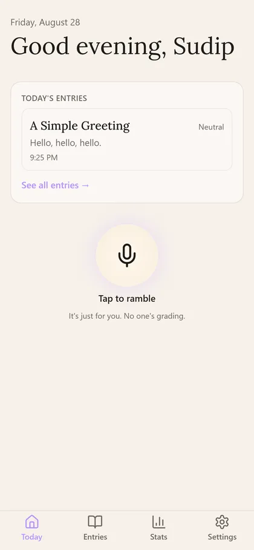
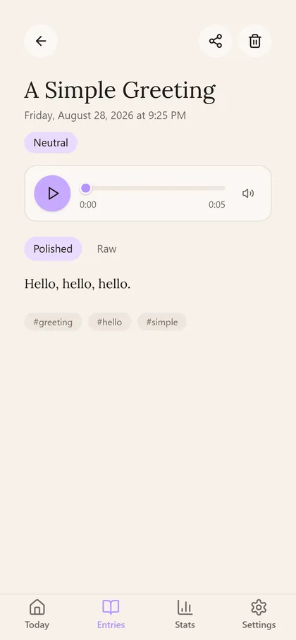
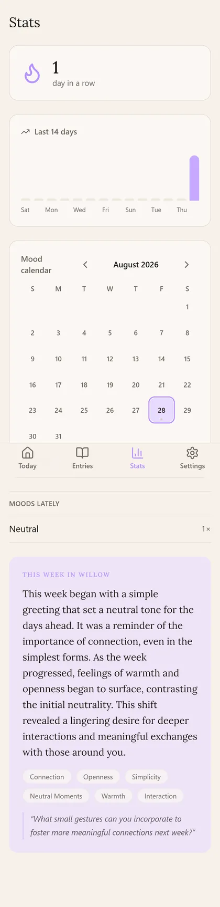
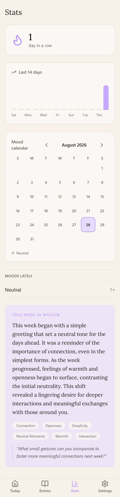
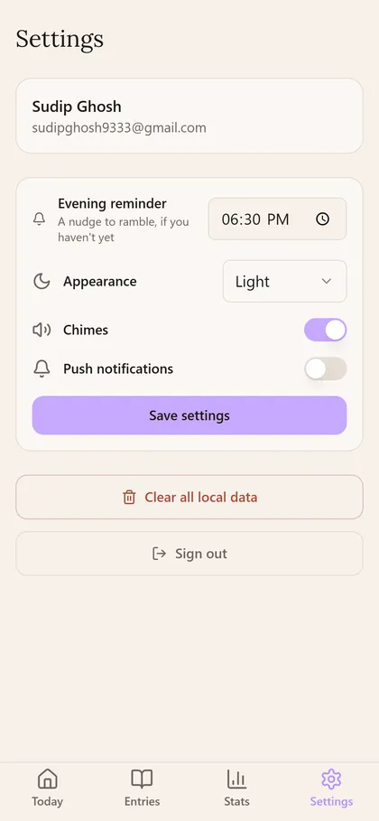

<div align="center">
  <a href="https://willow-alpha-one.vercel.app" target="_blank">
    
  </a>
  <h1>Willow</h1>

  **Voice-first journaling.** Ramble at the end of the day; Willow transcribes it,
  cleans it up, and stores it as a journal entry — with streaks, mood tracking,
  daily prompts, and a weekly AI digest.

  [![Website][badge-website]][link-website]
  [![Platforms][badge-platforms]][link-website]
  [![AGPL Licence][badge-license]](LICENSE)
  [![Last commit][badge-last-commit]][link-commits]
  [![Tests][badge-tests]][link-actions]
  [![Deploys][badge-deploys]][link-actions]

  [Features](#features) •
  [Planned](#planned-features) •
  [Screenshots](#screenshots) •
  [Getting Started](#getting-started) •
  [Documentation](#documentation) •
  [Troubleshooting](#troubleshooting) •
  [Support](#support) •
  [License](#license)

  <a href="https://willow-alpha-one.vercel.app" target="_blank">
    
  </a>
</div>

## Features

✅ Implemented

| **Feature** | **Description** | **Status** |
| --- | --- | --- |
| **Voice recording** | Ramble into the mic; audio uploads straight to R2 via presigned URLs | ✅ |
| **AI transcription** | Audio → text via OpenAI `gpt-live-transcribe` | ✅ |
| **AI cleanup** | Raw transcript cleaned into a structured journal entry | ✅ |
| **Daily prompts** | Per-user, per-day AI-crafted prompt questions | ✅ |
| **Weekly digest** | AI-generated "week in review" push notification | ✅ |
| **Streaks & mood** | Daily streak tracking and mood calendar | ✅ |
| **Offline-first sync** | IndexedDB (Dexie) + background sync engine | ✅ |
| **PWA** | Installable, offline-capable, auto-updating service worker | ✅ |
| **Web Push reminders** | Evening reminder if you haven't journaled today | ✅ |
| **Free-tier cost ceiling** | Hard gates: 9.9 GB R2 storage, 50 uploads/user/day | ✅ |

## Planned Features

🔄 Planned

| **Feature** | **Description** | **Status** |
| --- | --- | --- |
| **Advanced stats** | Deeper insights: word counts, topics, sentiment over time | 🔄 |
| **Export** | One-click export of your journal (Markdown / JSON) | 🔄 |
| **Multi-device media** | Store and play audio on all your devices from the web | 🔄 |

Stay tuned for continuous improvements — contributions are welcome! 😊

## Screenshots







---

## Getting Started

### Try it live

**[willow-alpha-one.vercel.app](https://willow-alpha-one.vercel.app/)** — no install needed; works as an installable PWA.

### Run locally (dev)

```bash
npm install

# ONE env file for everything — copy the template and fill it in
cp .env.example .env.local

# start both servers
npm run dev            # API on :8777 (hot reload)
npm run dev:web        # web on :5173 (proxies /api → :8777)
```

Open http://localhost:5173.

> Every service's variables are annotated in [`.env.example`](.env.example) —
> API runtime, web build, Neon Functions, GitHub Actions, and Vercel.

### Deploy with your own accounts

Willow is built to be self-hosted. One pipeline deploys and manages every
service (API → Neon, web → Vercel, cron + CI via GitHub Actions) on push to
`main`:

```bash
bash scripts/push-secrets-to-github.sh   # pushes your .env.local values to GitHub
```

Then open a **pull request** from your feature branch (or personal fork) into
`main` — the `Deploy` pipeline runs when it's merged. **Don't push to `main`
directly**; use the normal PR flow so CI gates and review apply.

## Documentation

Guides and per-service wikis live in the repository:

- **[docs/README.md](docs/README.md)** — index of the per-service wikis
- **[API + Database (Neon)](docs/api-database-neon.md)** — Hono API, migrations, deploy
- **[Frontend (Vercel)](docs/frontend-vercel.md)** — static PWA, proxy, rollback
- **[Audio storage (R2)](docs/audio-storage-r2.md)** — presigned URLs, guardrails
- **[CI/CD & cron (GitHub Actions)](docs/ci-cd-github-actions.md)** — pipelines, secrets
- **[AI features (OpenAI)](docs/ai-features-openai.md)** — models, cost
- **[ARCHITECTURE.md](ARCHITECTURE.md)** — deep dive: data model, sync, auth, cost ceiling
- **[CONTRIBUTING.md](CONTRIBUTING.md)** — setup, scripts, DB workflows

## Troubleshooting

### 1. Transcription produces no text

**Symptom** — Entries save but stay untranscribed.

**Cause** — The OpenAI key is missing, or lacks access to `gpt-live-transcribe` / `gpt-4o-mini`.

**How to fix** — Confirm `OPENAI_API_KEY` is set in `.env.local` (and in the
GitHub `OPENAI_API_KEY` secret for deployed functions), then check the Neon
function logs for the OpenAI error.

### 2. Auth fails with `INVALID_ORIGIN`

**Symptom** — Sign-out or cookie refresh fails on the deployed app.

**Cause** — `PUBLIC_ORIGIN` doesn't match the deployed origin exactly.

**How to fix** — Set `PUBLIC_ORIGIN` to your exact Vercel URL (e.g.
`https://willow-alpha-one.vercel.app`) and redeploy.

### 3. Deploy pipeline fails at the Vercel step

**Symptom** — `deploy-web` fails to authenticate.

**Cause** — `VERCEL_TOKEN` isn't set as a GitHub secret.

**How to fix**

```bash
vercel tokens create          # create a CI token
gh secret set VERCEL_TOKEN    # add it to the repo
```

**Still stuck?** — Open a [discussion](https://github.com/imsudip/willow/discussions) with logs from the failing workflow run.

## Support

Willow is a hobby project running on free tiers (Neon + Vercel + Cloudflare R2
+ GitHub Actions; OpenAI is the only metered cost, ~$2.55/mo for a daily 5-min
ramble). If it's useful, consider supporting the project:

- ☕ **[Buy me a chai](https://www.buymeachai.in/sudipghosh9333)** — one-off tip, no subscription
- ⭐ [Sponsor on GitHub](https://github.com/sponsors/imsudip)

Contributions and suggestions are always welcome. 🙏

## License

Willow is free software licensed under the [GNU Affero General Public License
v3.0](LICENSE). See the [LICENSE](LICENSE) file for details.

Libraries used: [Hono](https://github.com/honojs/hono) (MIT),
[React](https://github.com/facebook/react) (MIT), [Better Auth](https://github.com/better-auth/better-auth) (MIT),
[Drizzle ORM](https://github.com/drizzle-team/drizzle-orm) (Apache-2.0),
[Vite](https://github.com/vitejs/vite) (MIT), [Dexie](https://github.com/dexie/Dexie.js) (Apache-2.0).

---

<div align="center" style="color: gray;">Happy journaling with Willow! 🌿</div>

[badge-website]: https://img.shields.io/badge/website-willow--alpha--one.vercel.app-8B5CF6
[link-website]: https://willow-alpha-one.vercel.app/
[badge-platforms]: https://img.shields.io/badge/platforms-Web%20%2F%20PWA-8B5CF6
[badge-license]: https://img.shields.io/badge/license-AGPL--3.0-teal
[link-commits]: https://github.com/imsudip/willow/commits/main
[badge-last-commit]: https://img.shields.io/github/last-commit/imsudip/willow?color=blue
[link-actions]: https://github.com/imsudip/willow/actions
[badge-tests]: https://img.shields.io/github/actions/workflow/status/imsudip/willow/ci.yml?label=tests
[badge-deploys]: https://img.shields.io/github/actions/workflow/status/imsudip/willow/deploy.yml?label=deploys
