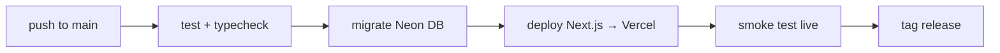

# Willow — Documentation

This folder is the **per-service wiki**. Each service gets its own page: what
it is, how it's hosted, how it's configured, and how to deploy/manage it.

> For the big-picture architecture and data flow, see
> [`ARCHITECTURE.md`](../ARCHITECTURE.md). For the quick start, see
> [`CONTRIBUTING.md`](../CONTRIBUTING.md).

## Services

| Service | Wiki | Host |
|---|---|---|
| App (Next.js: UI + API incl. PWA) + Database | [api-database-neon.md](./api-database-neon.md) · [frontend-vercel.md](./frontend-vercel.md) | Vercel + Neon Postgres |
| Audio storage | [audio-storage-r2.md](./audio-storage-r2.md) | Cloudflare R2 |
| CI/CD + scheduled jobs | [ci-cd-github-actions.md](./ci-cd-github-actions.md) | GitHub Actions |
| AI features | [ai-features-openai.md](./ai-features-openai.md) | OpenAI |
| **Secrets & env** | **[environment-secrets.md](./environment-secrets.md)** | Where to get every token/secret |

## Environment

Willow uses a **single unified environment file** at the repo root:

```bash
cp .env.example .env.local   # then fill in your values
```

`.env.local` is gitignored. It serves the Next.js app in dev, and the same
values are set as **Vercel project env vars** in production + mirrored to
**GitHub Actions** (via `scripts/push-secrets-to-github.sh`). See
[`.env.example`](../.env.example) for the annotated list.

**In production** — the same values are NOT read from `.env.local`; they come
from **Vercel project env vars**:
- Server secrets (`DATABASE_URL`, `OPENAI_API_KEY`, `AUTH_SECRET`, `R2_*`,
  `CRON_SECRET`, `VAPID_*`, `PUBLIC_ORIGIN`) are set as **Vercel project env
  vars**.
- `NEXT_PUBLIC_VAPID_PUBLIC_KEY` is the only client-visible var — set in the
  **Vercel project**.
- `WILLOW_API_URL` / `WILLOW_PRODUCTION_URL` (the Vercel prod URL) are GitHub
  **vars** for cron + smoke test.

In **local development**, all of the above (including server secrets) ARE read
from the root `.env.local`.

## Deploying

One pipeline on push to `main` handles everything
([ci-cd-github-actions.md](./ci-cd-github-actions.md)):



To point the pipeline at **your own** accounts, run once:

```bash
bash scripts/push-secrets-to-github.sh
```
