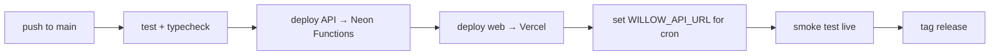

# Willow — Documentation

This folder is the **per-service wiki**. Each service gets its own page: what
it is, how it's hosted, how it's configured, and how to deploy/manage it.

> For the big-picture architecture and data flow, see
> [`ARCHITECTURE.md`](../ARCHITECTURE.md). For the quick start, see
> [`CONTRIBUTING.md`](../CONTRIBUTING.md).

## Services

| Service | Wiki | Host |
|---|---|---|
| API + Database | [api-database-neon.md](./api-database-neon.md) | Neon Functions + Neon Postgres |
| Frontend (PWA) | [frontend-vercel.md](./frontend-vercel.md) | Vercel (static) |
| Audio storage | [audio-storage-r2.md](./audio-storage-r2.md) | Cloudflare R2 |
| CI/CD + scheduled jobs | [ci-cd-github-actions.md](./ci-cd-github-actions.md) | GitHub Actions |
| AI features | [ai-features-openai.md](./ai-features-openai.md) | OpenAI |
| **Secrets & env** | **[environment-secrets.md](./environment-secrets.md)** | Where to get every token/secret |

## Environment

Willow uses a **single unified environment file** at the repo root:

```bash
cp .env.example .env.local   # then fill in your values
```

`.env.local` is gitignored. It serves **most** services — the API runtime, the
web build (Vite), Neon Functions, and GitHub Actions. See
[`.env.example`](../.env.example) for the annotated list.

**Exceptions — values NOT read from `.env.local`:**
- `WILLOW_API_URL` is set in the **Vercel project** (the edge middleware reads
  it at runtime); the `Deploy` workflow injects it at build time too.
- `VITE_VAPID_PUBLIC_KEY` is set in the **Vercel project** for production builds.
- GitHub secrets/vars are mirrored by `scripts/push-secrets-to-github.sh` (the
  repo's `.env.local` values are copied into GitHub Actions).

## Deploying

One pipeline on push to `main` handles everything
([ci-cd-github-actions.md](./ci-cd-github-actions.md)):



To point the pipeline at **your own** accounts, run once:

```bash
bash scripts/push-secrets-to-github.sh
```
