# Wiki — API & Database (Neon)

> Part of the [Willow docs](../README.md#documentation). See also
> [Architecture](../ARCHITECTURE.md) for the big-picture flow.

## What this is

The **Hono API** (`apps/api`) is the brain of Willow. It runs as a **Neon
Function** (Node 24 serverless) sitting right next to the **Neon Postgres**
database, so DB access is local and fast. It handles:

- **Auth** — Better Auth (email/password) backed by Postgres tables
- **Entries** — journal entries, sync, stats
- **Transcription & AI** — OpenAI: audio → transcript → cleaned entry, daily
  prompts, weekly digest
- **Web Push** — VAPID push notifications
- **Cron endpoints** — `/api/cron/{reminder,digest,retention}`, auth-gated by
  `CRON_SECRET`

## How it's hosted

| Piece | Host | Why |
|---|---|---|
| API (Hono) | **Neon Functions** | Node 24 serverless next to Postgres; `export default app` works directly |
| Database | **Neon Postgres** | Free tier: 100 CU-hrs/mo, 0.5 GB; scale-to-zero after 5 min idle |

### Neon Functions: the deploy API

The Neon CLI's `neon functions deploy --src` only ships the esbuild output —
not sibling folders — so the Drizzle `drizzle/` migrations would be missing at
runtime. Willow packages them explicitly:

```mermaid
flowchart LR
    S[src/function.ts] -->|tsc + esbuild| B[dist/function.mjs]
    B --> P[function.zip]
    D[drizzle/ migrations] --> P
    P -->|POST multipart<br/>zip + environment JSON| N[(Neon deploy API)]
    N --> F[Neon Function boots]
    F --> M[migrate&#40;&#41; runs migrations]
```



Scripts:

- `apps/api/scripts/neon-deploy.mjs` — CI-first, reads the process env
  (used by `.github/workflows/deploy.yml`)

### Migrations

The function runs `migrate()` on boot (`apps/api/src/db/bootstrap.ts`).
Drizzle's journal-based migrator tracks applied migrations in
`drizzle.__drizzle_migrations`, so every cold start is safe and later
migrations apply exactly once. For databases created before tracking existed,
it one-time-reconciles the journal so the existing schema is treated as
already migrated.

## Configuration

All values live in the **single root `.env.local`** (template:
[`.env.example`](../.env.example)). Vars used by the API:

| Var | Required | Notes |
|---|---|---|
| `DATABASE_URL` | yes | Injected by Neon on Functions; `neon env pull` locally |
| `OPENAI_API_KEY` | yes | Transcription + cleanup + prompts + digest |
| `TRANSCRIPTION_MODEL` / `CLEANUP_MODEL` | no | Defaults `gpt-live-transcribe` / `gpt-4o-mini` |
| `R2_ACCOUNT_ID` / `R2_ACCESS_KEY_ID` / `R2_SECRET_ACCESS_KEY` | yes | R2 S3 creds for presigned URLs |
| `R2_API_TOKEN` | yes | Cloudflare API token (R2 read) for the usage gate |
| `R2_BUCKET` | no | Default `willow-audio` |
| `CRON_SECRET` | yes | Shared with GitHub Actions |
| `AUTH_SECRET` | yes | Better Auth session secret |
| `PUBLIC_ORIGIN` | yes in prod | Vercel URL; drives auth + CORS |
| `CRON_TIMEZONE` | no | Default `Asia/Kolkata`; must match workflow schedules |
| `VAPID_*` | for push | Web Push keys |
| `R2_STORAGE_LIMIT_BYTES` | no | Default 9.9 GB |
| `MAX_UPLOADS_PER_USER_PER_DAY` | no | Default 50 |
| `MAX_AUDIO_UPLOAD_BYTES` | no | Default 10 MB |
| `REMINDER_CRON` | no | Default `30 18 * * *` |
| `MIGRATIONS_DIR` | no | Where the bundled `drizzle/` folder lives |

## Deploying

**Automated** (recommended): push to `main` → `.github/workflows/deploy.yml`
deploys the API automatically.

**Manual**:

```bash
# one-time link (us-east-2 — required for Functions)
neon link

# CI-first script (reads env from the shell / CI):
node apps/api/scripts/neon-deploy.mjs
```

## Managing (local dev / DB changes)

```bash
# point at your Neon branch
neon link && neon checkout main   # writes .env.local DATABASE_URL

# schema changes → migrations
cd apps/api && npx drizzle-kit generate --name <name>
# apply locally:
cd apps/api && npx drizzle-kit push
```

Committed migrations apply automatically on the next function boot.

## Troubleshooting

- **Cold start is slow** — first request after scale-to-zero can take a few
  seconds; not a bug.
- **`INVALID_ORIGIN` on auth** — `PUBLIC_ORIGIN` must match the deployed
  origin exactly.
- **Function deploys but `/api/health` 404s** — confirm the zip contains
  `drizzle/` and `index.mjs` at the root; check the Neon function logs.
