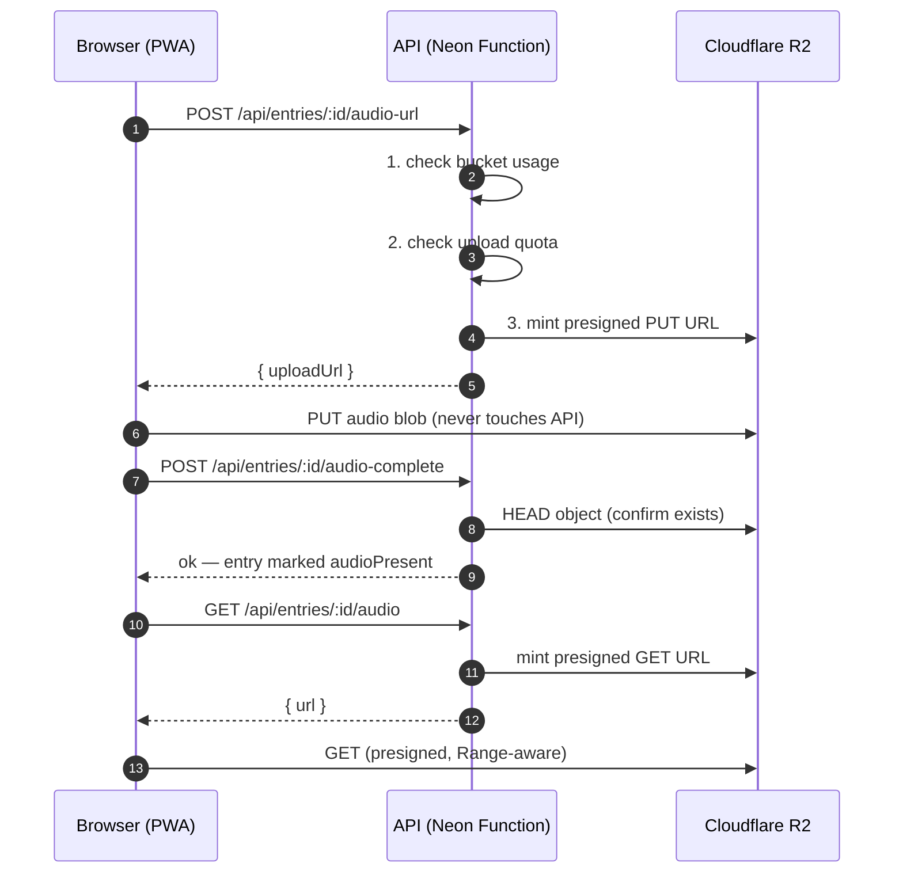

# Wiki — Audio Storage (Cloudflare R2)

> Part of the [Willow docs](../README.md#documentation). See also
> [Architecture](../ARCHITECTURE.md) for the big-picture flow.

## What this is

**Cloudflare R2** stores the audio recordings. For **storage**, the browser
never sends audio through the API — it uses short-lived presigned URLs to
upload/download straight to R2, so the function isn't a bandwidth bottleneck
and there are **zero egress fees**. (Transcription is a separate flow: audio
is sent to the API's `/api/transcribe` endpoint for OpenAI processing.)

- Bucket: `willow-audio`
- Free tier: 10 GB storage, 1M Class A + 10M Class B ops/mo, no egress

## How the audio flow works



- Upload URLs: **1-hour expiry**, `Content-Type: audio/webm` pinned, signed
  `Content-Length` cap (oversized uploads fail at R2).
- An entry is only marked `audioPresent` after the server confirms the object
  exists (HEAD).
- Playback URLs: **1-hour expiry**.
- Object keys: `audio/{userId}/{entryId}.webm` — user-scoped, so a valid URL
  can't reach another user's file.
- R2 supports HTTP `Range` natively on presigned GETs → audio seeking works
  with no API involvement.

## Free-tier guardrails (why some vars exist)

- **`audio_uploads` table** backs the **50 uploads/user/day** cap (slots are
  reserved in a transaction, so concurrent requests can't bypass it).
- **`R2_STORAGE_LIMIT_BYTES`** (default 9.9 GB) is checked against the bucket's
  live usage before minting upload URLs — you can never exceed the 10 GB tier.

## Configuration

All values live in the **single root `.env.local`** (template:
[`.env.example`](../.env.example)).

| Var | Required | Notes |
|---|---|---|
| `R2_ACCOUNT_ID` / `R2_ACCESS_KEY_ID` / `R2_SECRET_ACCESS_KEY` | yes | R2 S3 API token ("Object Read & Write") for presigned URLs |
| `R2_API_TOKEN` | yes | Cloudflare API token with R2 read (free-tier usage gate) |
| `R2_BUCKET` | no | Default `willow-audio` |
| `R2_STORAGE_LIMIT_BYTES` | no | Default 9.9 GB |
| `MAX_UPLOADS_PER_USER_PER_DAY` | no | Default 50 |
| `MAX_AUDIO_UPLOAD_BYTES` | no | Default 10 MB (Content-Length-capped PUT) |

## One-time setup

Create the bucket and credentials (not needed if you're using an existing
Willow setup — only for a fresh deploy):

```bash
# 1. bucket
npx wrangler r2 bucket create willow-audio

# 2. CORS policy — allow PUT/GET/HEAD from your app origin + localhost
#    (save the JSON from ARCHITECTURE.md §3 / README as r2-cors.json)
npx wrangler r2 bucket cors set willow-audio --file r2-cors.json

# 3. R2 API token ("Object Read & Write") + Cloudflare API token (R2 read)
#    → dash.cloudflare.com → R2 → Manage R2 API Tokens
#    put the values in .env.local
```

## Managing / troubleshooting

- **Uploads fail with 403** — check the CORS policy includes your origin and
  the `Content-Type: audio/webm` header is pinned in the presigned URL.
- **Storage near limit** — the app rejects new uploads at `R2_STORAGE_LIMIT_BYTES`
  (default 9.9 GB); raise it only if you move off the free tier.
- **Retention** — the nightly `/api/cron/retention` job prunes old audio.
- **Cost ceiling** — hard-stopped at 9.9 GB by the in-app gate; no egress fees.
