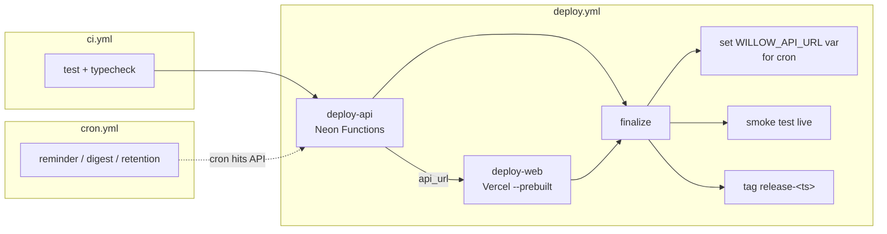

# Wiki — CI/CD & Scheduled Jobs (GitHub Actions)

> Part of the [Willow docs](../README.md#documentation). See also
> [Architecture](../ARCHITECTURE.md) for the big-picture flow.

## What this is

**GitHub Actions** runs Willow's automation: **CI** (tests/typecheck),
**CD** (the deploy pipeline), and **scheduled jobs** (the cron that used to run
in-process). Neon Functions are request-driven, so they can't hold a background
scheduler — the three jobs became authenticated endpoints triggered by a
scheduled workflow.

## Workflows

| File | When | What it does |
|---|---|---|
| `.github/workflows/ci.yml` | every PR + push to `main` | `npm ci` → `npm run typecheck` → `npm test` (cheap gate, no deploy) |
| `.github/workflows/deploy.yml` | push to `main` / manual dispatch | test → deploy API to Neon → deploy web to Vercel → re-sync `WILLOW_API_URL` for cron → smoke test → tag release |
| `.github/workflows/cron.yml` | schedule (timezone-aware) | triggers `/api/cron/{reminder,digest,retention}` |

### The deploy pipeline (`deploy.yml`)



- Jobs are serialized with `concurrency` (no overlapping prod deploys).
- `deploy-api` derives the function URL and passes it to `deploy-web` (for the
  Vercel middleware) and `finalize` (for the cron var + smoke test).
- `deploy-web` uses `vercel deploy --prebuilt --prod` so Vercel doesn't
  rebuild the same artifact twice.

### Scheduled jobs (`cron.yml`)

| Job | Schedule (Asia/Kolkata) | Endpoint | What it does |
|---|---|---|---|
| Evening reminder | daily `30 18 * * *` | `POST /api/cron/reminder` | Push to users with no entry today, with the day's prompt |
| Weekly digest | Sunday `0 19 * * 0` | `POST /api/cron/digest` | Push a "week in review" notification |
| Audio retention | nightly `30 4 * * *` | `POST /api/cron/retention` | Delete R2 audio older than retention window |

Notes:
- GitHub Actions fires scheduled jobs within **±~30 min** of the cron time —
  fine for a journaling nudge.
- `CRON_TIMEZONE` must match the workflow schedules so the reminder's "today"
  boundary agrees.

## Secrets & variables

Populate everything in one go (reads the single root `.env.local`):

```bash
bash scripts/push-secrets-to-github.sh
```

- **Secrets** (masked): `NEON_API_KEY`, `OPENAI_API_KEY`, `AUTH_SECRET`,
  `CRON_SECRET`, `R2_*`, `VAPID_*`, plus `VERCEL_TOKEN` (create with
  `vercel tokens create`, then `gh secret set VERCEL_TOKEN`) and
  `GH_VARIABLES_TOKEN` (fine-grained PAT with **"Repository variables"** write
  permission — the deploy pipeline uses it to re-sync `WILLOW_API_URL`; the
  default `GITHUB_TOKEN` can't write repo variables).
- **Variables** (non-secret): `NEON_PROJECT_ID`, `NEON_BRANCH_ID`,
  `NEON_FUNCTION_SLUG`, `R2_BUCKET`, tuning limits, `PUBLIC_ORIGIN`,
  `CRON_TIMEZONE`, `VAPID_SUBJECT`, `VERCEL_ORG_ID`, `VERCEL_PROJECT_ID`,
  `WILLOW_API_URL` (re-synced on every deploy).

## Managing / troubleshooting

- **Deploy failed at `deploy-api`** — check the Neon function deploy API
  response (logs in the Actions step); confirm `NEON_*` vars are set.
- **Deploy failed at `deploy-web`** — `VERCEL_TOKEN` is the usual culprit;
  regenerate with `vercel tokens create` and `gh secret set VERCEL_TOKEN`.
- **Cron not firing** — GitHub Actions skips scheduled runs on repos with no
  activity for 60 days; push a commit or run `workflow_dispatch`.
- **Manual runs** — every workflow supports `workflow_dispatch` from the
  Actions tab.
