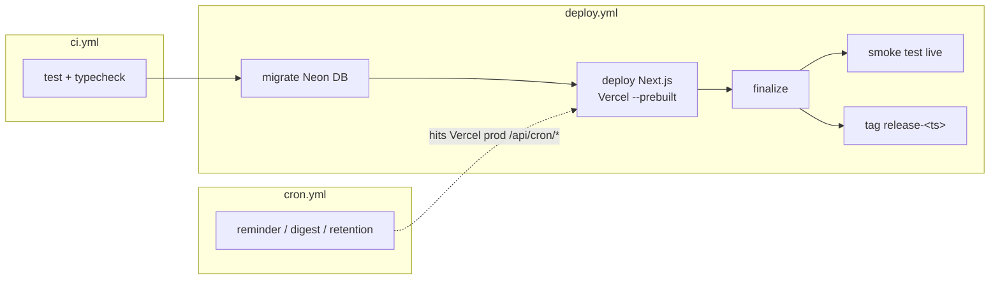

# Wiki — CI/CD & Scheduled Jobs (GitHub Actions)

> Part of the [Willow docs](../README.md#documentation). See also
> [Architecture](../ARCHITECTURE.md) for the big-picture flow.

## What this is

**GitHub Actions** runs Willow's automation: **CI** (tests/typecheck),
**CD** (the deploy pipeline), and **scheduled jobs**. Willow is a single Next.js
app on Vercel — there's no separate API host — but Vercel Cron on the Hobby
plan is capped at 1 run/day, so the three cron jobs stay as GitHub Actions
scheduled workflows that hit the app's `/api/cron/*` endpoints.

## Workflows

| File | When | What it does |
|---|---|---|
| `.github/workflows/ci.yml` | every PR + push to `main` | `npm ci` → `npm run typecheck` → `npm test` (cheap gate, no deploy) |
| `.github/workflows/deploy.yml` | push to `main` / manual dispatch | test → migrate Neon → build & deploy the Next.js app to Vercel → smoke test → tag release |
| `.github/workflows/cron.yml` | schedule (timezone-aware) | triggers `/api/cron/{reminder,digest,retention}` on the Vercel prod URL |

### The deploy pipeline (`deploy.yml`)



- Jobs are serialized with `concurrency` (no overlapping prod deploys).
- `deploy` runs `drizzle-kit migrate` against Neon before building, then uses
  `vercel deploy --prebuilt --prod` so Vercel doesn't rebuild twice.
- `finalize` smoke-tests the live production `/api/health` and tags a release.

### Scheduled jobs (`cron.yml`)

| Job | Schedule (Asia/Kolkata) | Endpoint | What it does |
|---|---|---|---|
| Evening reminder | daily `30 18 * * *` | `POST /api/cron/reminder` | Push to users with no entry today, with the day's prompt |
| Weekly digest | Sunday `0 19 * * 0` | `POST /api/cron/digest` | Push a "week in review" notification |
| Audio retention | nightly `30 4 * * *` | `POST /api/cron/retention` | Delete R2 audio older than retention window |

Notes:
- `WILLOW_API_URL` must be the **Vercel production URL** (e.g.
  `https://willow-alpha-one.vercel.app`) — the Next app serves `/api/cron/*`
  itself.
- GitHub Actions fires scheduled jobs within **±~30 min** of the cron time —
  fine for a journaling nudge.
- `CRON_TIMEZONE` must match the workflow schedules so the reminder's "today"
  boundary agrees.

## Secrets & variables

Populate everything in one go (reads the single root `.env.local`):

```bash
bash scripts/push-secrets-to-github.sh
```

- **Secrets** (masked): `DATABASE_URL`, `OPENAI_API_KEY`, `AUTH_SECRET`,
  `USER_CONFIG_SECRET`, `CRON_SECRET`, `R2_*`, `VAPID_*`, plus `VERCEL_TOKEN`
  (create via the [Vercel Tokens page](https://vercel.com/account/tokens) or
  `vercel tokens add "<name>"`, then `gh secret set VERCEL_TOKEN`).
- **Variables** (non-secret): `R2_BUCKET`, tuning limits, `PUBLIC_ORIGIN`,
  `CRON_TIMEZONE`, `VAPID_SUBJECT`, `VERCEL_ORG_ID`, `VERCEL_PROJECT_ID`,
  `WILLOW_API_URL` (Vercel prod URL, for cron), `WILLOW_PRODUCTION_URL`.

## Managing / troubleshooting

- **Deploy failed at `deploy`** — `VERCEL_TOKEN` is the usual culprit;
  regenerate via the [Vercel Tokens page](https://vercel.com/account/tokens)
  (or `vercel tokens add "<name>"`) and `gh secret set VERCEL_TOKEN`. Also
  confirm `DATABASE_URL` is a secret (the migrate step needs it).
- **Cron not firing** — GitHub Actions skips scheduled runs on repos with no
  activity for 60 days; push a commit or run `workflow_dispatch`.
- **Manual runs** — every workflow supports `workflow_dispatch` from the
  Actions tab.
