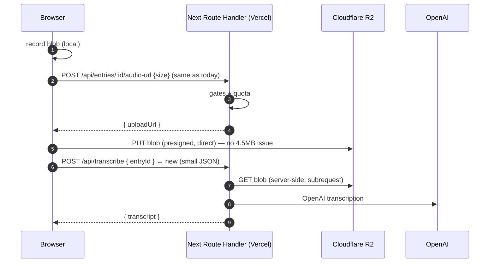

# Willow → Next.js Migration Plan

> Status: ✅ **Applied** (2026-08-29) · The migration shipped as PR #3
> ("feat: migrate to Next.js"). This document is the **historical planning
> artifact** for that migration — Phases 1–4.5 are complete. It's kept for
> context; the live source of truth is [ARCHITECTURE.md](../ARCHITECTURE.md)
> and the [docs](../docs/README.md).
>
> Target (as planned): a single Next.js app on **Vercel Hobby**, with **Neon
> Postgres** and **Cloudflare R2** retained, and **GitHub Actions cron**
> retained.

---

## 1. Goal & non-goals

**Goal**: merge `apps/api` (Hono) and `apps/web` (Vite PWA) into one Next.js
app deployed on Vercel Hobby, so the app is one codebase, one deploy, and
same-origin (no edge proxy, no cross-origin auth, no Neon Functions packaging).

### 1.1 Decision: **Path A** (client-rendered SPA + Next.js server), locked in

After reviewing real-world apps (see §13), the decision is **Path A**:

- **Next.js runs the server**: Route Handlers for every `/api/*` endpoint,
  Better Auth, Drizzle/Neon, R2 presigned audio, cron, single Vercel deploy.
- **The client stays a client-rendered SPA** with Dexie as the local source of
  truth (the same architecture as today). We do **not** adopt SSR/RSC screen
  rendering.
- This is the industry-proven shape for an **offline-first PWA that will later
  be wrapped in Capacitor/Tauri** (see §13 for the GitHub evidence).

**Why not Path B (full App Router/RSC rewrite)?** — documented for the future
so the reasoning isn't lost:

- An offline-first PWA needs the app to run without the server; SSR/RSC makes
  the client *depend on* the server, which is the opposite requirement.
- There is **no official offline story** for SSR/RSC in Next.js — the correct
  offline pattern is SPA-fallback (confirmed by Next.js collaborators).
- Willow's UI is a working, tested PWA; a rewrite buys nothing for the native
  goal and risks the offline/sync behavior.
- Next.js is being used for its **server + hosting** value, not its renderer.
  That is a fully idiomatic use of Next.js.

**Non-goals** (unchanged):
- Keep **Neon Postgres** as the database (migrations preserved).
- Keep **Cloudflare R2** for audio storage via presigned URLs (browser → R2
  direct).
- Keep **GitHub Actions** as the cron scheduler (Vercel Cron on Hobby is capped
  at **1 run/day**; Willow needs daily + weekly jobs).
- Keep the **offline-first PWA** behavior (Dexie + service worker) — this is
  the hardest part of the migration and the top risk.

**Why Vercel Hobby is safe on the runtime front** (verified 2026-08-29):
- Vercel Functions default & max duration on Hobby is **300s (5 min)** — your
  ~1-min transcription fits with room to spare. The old "10s" limit is gone.
- Hobby includes **1M invocations**, **4 CPU-hrs**, **100 GB** fast data
  transfer, **200 projects**.

---

## 2. What the migration touches (inventory)

### 2.1 API surface (must be preserved 1:1)

| Current route (Hono) | Next.js Route Handler | Notes |
|---|---|---|
| `POST/GET /api/auth/*` | `app/api/auth/[...all]/route.ts` | Better Auth `toNextJsHandler` |
| `GET/POST /api/entries/sync` | `app/api/entries/sync/route.ts` | push/pull |
| `GET /api/entries/:id`, `GET /api/entries` | `app/api/entries/[id]/route.ts`, `app/api/entries/route.ts` | |
| `POST /api/entries/:id/audio-url` | `app/api/entries/[id]/audio-url/route.ts` | R2 presigned PUT (gate + quota) |
| `POST /api/entries/:id/audio-complete` | `app/api/entries/[id]/audio-complete/route.ts` | size verify + mark present |
| `POST /api/entries/:id/audio-release` | `app/api/entries/[id]/audio-release/route.ts` | quota release |
| `GET/DELETE /api/entries/:id/audio` | `app/api/entries/[id]/audio/route.ts` | presigned GET / delete |
| `GET /api/prompts/daily`, `DELETE /api/prompts/cleanup` | `app/api/prompts/...` | |
| `POST /api/transcribe` **→ rework** | see §4 | **4.5 MB Vercel body limit breaks multipart** |
| `POST /api/transcribe/cleanup` | `app/api/transcribe/cleanup/route.ts` | small JSON, fine |
| `GET /api/digest/weekly` | `app/api/digest/weekly/route.ts` | |
| `POST/DELETE /api/push/subscribe` | `app/api/push/subscribe/route.ts` | |
| `POST /api/cron/{reminder,digest,retention}` | `app/api/cron/[job]/route.ts` (or 3 files) | Bearer `CRON_SECRET`, hit by GitHub Actions |
| `GET /api/health` | `app/api/health/route.ts` | smoke test target |

### 2.2 Server modules that port almost verbatim
- `apps/api/src/db/schema.ts` → `src/lib/db/schema.ts` (Drizzle schema, unchanged)
- `apps/api/src/db/bootstrap.ts` → migration runner (see §5)
- `apps/api/src/lib/r2.ts` → `src/lib/r2.ts` (AWS SDK S3-client vs R2, presigned URLs — works fine in Next.js Node runtime)
- `apps/api/src/lib/timezone.ts`, `apps/api/src/services/{openai,cleanup,prompts,digest,push,transcription,prompt-sources}.ts` → `src/lib/` or `src/services/`
- `apps/api/src/env.ts` (Zod) → `src/env.ts` (server-only; load at build via Vercel env)
- `apps/api/src/auth.ts` → `src/lib/auth.ts` (Better Auth; add `basePath: "/api/auth"`)

### 2.3 Things that get **deleted**
- `apps/web/middleware.ts` (edge proxy) — gone: Next is same-origin now.
- `apps/web/vercel.json` rewrites — gone: Next App Router handles SPA fallback.
- `apps/api/src/function.ts`, `apps/api/src/index.ts`, `@hono/node-server`, `ws`, `@neon/functions`.
- `apps/api/scripts/neon-deploy.mjs` + the esbuild `build:function` packaging.
- The Neon **Functions** deployment itself (DB stays on Neon; the function compute is retired).
- `apps/api` CORS config + `trustedOrigins` — same-origin means no CORS needed.

### 2.4 Web pieces that need porting (not just moving)
- `src/lib/api.ts` `client.*` — same-origin fetch stays; the **transcribe** method changes shape (see §4).
- `src/lib/auth.tsx` — `createAuthClient()` stays, still same-origin.
- `src/lib/db.ts`, `src/lib/sync.ts` — Dexie sync engine ports as-is.
- `src/features/**`, `src/app/Shell.tsx`, `src/components/**` — UI. **Biggest risk**: Vite PWA + react-router vs Next App Router + RSC.
- Service worker (`src/sw.ts` + workbox) + `vite-plugin-pwa` — must be replaced with a Next.js-compatible PWA approach.

---

## 3. The big architectural decision: Vite PWA vs Next App Router

This is the fork in the road and it drives everything below. **Two viable paths:**

### Path A — "Keep the SPA, wrap it in Next" (lower risk, faster)
Keep the current React 19 SPA (react-router, Dexie, workbox SW) largely intact,
and add a thin Next.js shell:
- The SPA runs as-is (same components, same client logic, same SW/offline).
- Next.js provides the server: Route Handlers for `/api/*`, and a single
  catch-all that serves the SPA `index.html` (static).
- This is essentially your current split **without** the separate API host — you
  get the "merge" benefit (one deploy, same-origin, one env set) with minimal
  UI churn.
- **Cost**: you don't get RSC/SSR benefits; the SPA is still client-rendered.
  But Willow is a PWA that already renders everything client-side — SSR/RSC buys
  little here.

### Path B — "Full Next.js App Router rewrite" (bigger lift, more idiomatic)
Migrate screens to Server/Client Components, App Router routes, RSC data
fetching, `next/pwa`-style SW integration.
- **Cost**: re-architect routing, every screen, the sync engine's interaction
  with the server, the SW. This is a large, risky rewrite of a working,
  offline-first app.
- **Benefit**: idiomatic Next.js, possible SSR for the login screen, unified
  caching.

**Recommendation: Path A.** The whole point of the migration is consolidation
(auth + deploy + env), not re-architecting the UI. Willow is a PWA where the
client is the source of truth (Dexie) — a full RSC rewrite would be high-effort,
high-risk, and gain little. Path A delivers the merge with the UI effectively
untouched.

> If you want a middle ground later, you can incrementally adopt App Router
> screen-by-screen after the merge is green.

---

## 4. ⚠️ Critical blocker: Vercel's 4.5 MB request-body limit

**Verified 2026-08-29**: Vercel Functions limit the request body (and response)
to **4.5 MB**. Your current `/api/transcribe` accepts a multipart audio blob
(`MAX_AUDIO_BYTES` = 25 MB; real recordings ≈ 10 MB). **This endpoint will
fail on Vercel.** Neon Functions have no such limit — which is why it works
today.

### Rework (recommended): transcribe from R2, not from the request body
You already have the exact machinery — the R2 presigned path. Change the flow so
the browser **never** sends audio through a Route Handler:



- The Route Handler receives only `{ entryId }` — a few hundred bytes, well under
  4.5 MB.
- The blob goes browser → R2 (as it already does for sync), then Route Handler
  → R2 (server-side `fetch`) → OpenAI.
- This **unifies** the record flow with the existing sync/audio flow (same R2
  object, same `audioPath`), so entries recorded get a server-side audio object
  the same way synced ones do.
- `RecordOverlay.tsx` changes from `client.transcribe(blob)` to
  `client.transcribeEntry(entryId)` after the upload completes.
- R2 egress note: you're reading the blob back from R2 to transcribe. R2 has no
  egress fees (0 egress) and free tier is 10 GB + 1M/10M ops — the extra GET is
  negligible and within your existing free-tier discipline.

### Alternative (not recommended): keep streaming transcription
Wispr Flow `/gpt-live-transcribe` supports streaming PCM via WebSocket/Realtime —
but that requires a persistent socket from the server, which a Route Handler
can't hold the way Neon Functions' `@hono/node-server` + `ws` did. Reworking to
streaming is a much bigger change. R2-fetch + batch is simpler and matches the
existing architecture.

---

## 5. Database: Drizzle + Neon inside Next.js

- **Keep the Drizzle schema** (`src/lib/db/schema.ts`) byte-for-byte — tables
  and migrations already exist in Neon.
- **Driver choice**: switch from `pg` `Pool` to **`drizzle-orm/neon-http`** (or
  `neon-http-serverless`) with `@neondatabase/serverless`. Rationale:
  - Serverless-native, no TCP connection pool to warm up per cold start.
  - Drizzle documents this as the canonical Next.js + Neon path.
  - ⚠️ **Correction (found in Phase 4.5):** `drizzle-orm/neon-http` has **no
    interactive transactions** — `db.transaction` throws. The
    `assertUploadQuota` gate was rewritten as a single atomic conditional
    INSERT (CTE) via the raw Neon client. Advisory locks are not used.
- **Singleton pattern** (required in Next.js dev / serverless):
  ```ts
  // src/lib/db/index.ts
  import { neon } from "@neondatabase/serverless";
  import { drizzle } from "drizzle-orm/neon-http";
  const sql = neon(process.env.DATABASE_URL!);
  const globalForDb = globalThis as unknown as { db?: ReturnType<typeof createDb> };
  function createDb() { return drizzle(sql, { schema }); }
  export const db = globalForDb.db ?? createDb();
  if (process.env.NODE_ENV !== "production") globalForDb.db = db;
  ```
- **Migrations**: instead of running `migrate()` at Neon-function boot, run
  `drizzle-kit migrate` as a **build/deploy step** in CI (against the Neon
  `DATABASE_URL` secret) — or via a one-shot `script:migrate` npm script. Keep
  the existing migration files in `drizzle/`.
  - The current `bootstrap.ts` reconcile logic (pre-tracking databases) is a
    one-time concern; after the merge, migrations are applied by the pipeline.
  - Never run migrations from a Route Handler on user traffic.

---

## 6. Auth: Better Auth (unchanged) + the additions you asked about

### 6.1 Same-origin setup (port)
- `src/lib/auth.ts`: keep `betterAuth({ database: drizzleAdapter(...), secret,
  baseURL, emailAndPassword, trustedOrigins })`. Remove CORS/`PUBLIC_ORIGIN`
  handling — same-origin means no trusted-origin list needed.
- `src/app/api/auth/[...all]/route.ts`:
  ```ts
  import { auth } from "@/lib/auth";
  import { toNextJsHandler } from "better-auth/next-js";
  export const { GET, POST } = toNextJsHandler(auth);
  ```
- Client (`src/lib/auth.tsx`): `createAuthClient()` unchanged — still
  same-origin, no `baseURL`.

### 6.2 Your new requirements — all natively supported (and free)
Better Auth is **free and open source**; the framework is self-hosted inside
your app. There is **no forced paid tier**. The optional paid "Better Auth
Infrastructure" (dashboard/audit logs) is not required.

| You asked for | Better Auth capability (verified) |
|---|---|
| **Social login** (Google/GitHub/etc.) | Built-in OAuth2/OIDC via `socialProviders: { google: { clientId, clientSecret }, github: {...} }`. Client `signIn.social({ provider: "google" })`; server `auth.api.signInSocial(...)`. Account linking via `linkSocial`. |
| **Email verification** | Built-in: `sendVerificationEmail` + `requireEmailVerification` + auto-sign-in after verify. |
| **Email OTP** | `emailOTP` plugin — sign-in, verify email, or reset password with a one-time code. |
| **Sending the emails** | **BYO email provider** (Resend, SES, Postmark, etc.) in the `sendVerificationOTP` / `sendVerificationEmail` callbacks. Free-path cost = your email provider's free tier (Resend has one). Better Auth's managed transactional email is $0.001/email only if you use their Pro infrastructure — not required. |

**Recommendation for Willow**: add `emailOTP` (or the built-in email-verification
link) + Google/GitHub `socialProviders` after the migration is green. This keeps
everything self-hosted on the free framework; you just plug in a free Resend
account for outbound email. No paid auth tier needed.

---

## 7. Env & secrets

- Vercel Hobby env vars are set in the **Vercel project dashboard** (or via
  `vercel env add`). Server-only vars stay server-side; nothing is bundled to
  the client. Only vars prefixed `NEXT_PUBLIC_` reach the browser — the only
  one today is `NEXT_PUBLIC_VAPID_PUBLIC_KEY` (a copy of the public VAPID key
  used by the browser to subscribe to push; the server keeps the private key
  in `VAPID_PRIVATE_KEY`).
- Keep the single root `.env.local` for local dev; update `.env.example` to
  document the new var usage.
- `PUBLIC_ORIGIN` → becomes the Vercel prod URL (drives Better Auth `baseURL`).
  `CRON_SECRET`, `OPENAI_API_KEY`, `DATABASE_URL`, `R2_*`, `AUTH_SECRET`,
  `VAPID_*`, `MAX_*`, `R2_STORAGE_LIMIT_BYTES` all remain, now as Vercel env +
  GitHub secrets (for cron + CI migration step).

---

## 8. Cron & scheduling (keep GitHub Actions)

- Willow needs: evening reminder (daily), weekly digest (Sunday), audio
  retention (nightly).
- **Vercel Cron on Hobby = 1 run/day, UTC, ±hour** → insufficient (you need 3
  schedules + timezone-aware "today"). **Keep GitHub Actions `cron.yml`**, now
  hitting the **Vercel production URL** (`$WILLOW_API_URL/api/cron/...`) instead
  of the Neon function URL.
- The three cron endpoints port to Route Handlers with the same
  `Authorization: Bearer $CRON_SECRET` check.

---

## 9. CI/CD changes

### `deploy.yml` (rewrite)
Replace the two-stage (Neon function + Vercel static) deploy with a **single
Vercel deploy** of the Next app:
1. `npm ci`
2. `npm run build` (shared → next)
3. **Run DB migrations** against Neon (`DATABASE_URL` from secrets)
4. `vercel pull --yes --environment=production`
5. `vercel build --prod`
6. `vercel deploy --prebuilt --prod`
7. Smoke test `$PROD/api/health`
8. Tag release

- Remove: `neon-deploy.mjs` step, `NEON_API_KEY` usage, `WILLOW_API_URL`
  derivation (no longer needed — the app is its own origin).
- Keep: the Postgres service container in `ci.yml`/test for the smoke tests
  (tests boot the real app).
- `VERCEL_TOKEN` must be team-scoped (already known from prior work).

### Retired files
`scripts/neon-deploy.mjs`, `apps/api/src/function.ts`, `apps/api/src/index.ts`,
`apps/web/middleware.ts`, `apps/web/vercel.json` (rewrites), Neon Functions
compute.

---

## 10. Rollout order (recommended sequence)

**Phase 0 — Decision gates (confirm with user)**
- [x] Path A (client-rendered SPA + Next server) — **locked in** (see §1.1, §13)
- [x] Repo layout → **single `apps/web`** Next app (server code in
      `apps/web/src/app/api` + `apps/web/src/lib`); retire `apps/api`;
      keep `packages/shared` as-is.
- [x] SPA build → **move the SPA into the Next build with Serwist**
      (`@serwist/next`) — single build system; retire Vite + `vite-plugin-pwa`.
- [x] DB driver → **`drizzle-orm/neon-http`** + `@neondatabase/serverless`
      (serverless-native HTTP; no pool warm-up; transactions/advisory locks
      preserved).
- [x] Transcribe → **rework to upload-to-R2 then transcribe-from-R2** (fixes
      the 4.5 MB Vercel request-body cap; client flow changes to
      record → upload R2 → `transcribe(entryId)` → cleanup).

**Phase 1 — Scaffold + server parity (no UI change)**
- [ ] Create Next app (`create-next-app`) in `apps/web` (or new `apps/app`),
      Next 16 + React 19 + TypeScript.
- [ ] Port `env.ts` (Zod), `db/schema.ts`, `db/index.ts` (neon-http singleton),
      `lib/r2.ts`, `lib/timezone.ts`, `services/*`.
- [ ] Port all `/api/*` Route Handlers (1:1 from §2.1) **except** the transcribe
      rework.
- [ ] Better Auth: `src/lib/auth.ts` + `app/api/auth/[...all]/route.ts` +
      auth client.
- [ ] Migrations run in CI (not function boot).
- [ ] Verify every Route Handler against the live Neon DB (manual + smoke test).

**Phase 2 — Transcribe rework (the 4.5 MB fix)**
- [ ] `POST /api/transcribe` → takes `{ entryId }`, fetches from R2, transcribes.
- [ ] Update `RecordOverlay.tsx` flow: record → upload to R2 → transcribe(entryId) → cleanup.
- [ ] Update `client.*` in `src/lib/api.ts`; keep `serverAudioUrl` pattern the SW caches.

**Phase 3 — UI/PWA integration (Path A)**
- [ ] Serve the existing SPA from the Next app (catch-all → static SPA).
- [ ] Port the service worker (workbox) so offline/PWA behavior is preserved.
- [ ] Verify sync engine, audio playback (SW cache), push.

**Phase 4 — Env, deploy, cron**
- [ ] Set Vercel env vars; update `.env.example`; remove `VITE_*` client vars.
- [ ] Rewrite `deploy.yml` (single Vercel deploy + migrations + smoke).
- [ ] Update `cron.yml` to point at the Vercel prod URL.
- [ ] Delete retired files; update `AGENTS.md`, `ARCHITECTURE.md`, `docs/*`,
      re-mirror wiki, update `README.md` per the sync checklist.

**Phase 5 — Auth additions (your new ask)**
- [ ] Add email OTP / email-verification + Resend (free tier).
- [ ] Add Google + GitHub social login (`socialProviders`).
- [ ] Update `LoginScreen` UI for the new sign-in options.

---

## 11. Risks & mitigations

| Risk | Severity | Mitigation |
|---|---|---|
| **4.5 MB body limit breaks `/api/transcribe`** | 🔴 High | Rework to transcribe-from-R2 (§4) — uses existing machinery |
| **PWA/offline regression** (Dexie SW, workbox, react-router) | 🔴 High | Path A keeps the SPA; port SW carefully; test offline in Phase 3 |
| **`db.transaction` on neon-http** | 🟡 Med | **Resolved:** neon-http has no interactive transactions; `assertUploadQuota` uses a single atomic CTE INSERT via the raw Neon client |
| **DB pool cold starts** | 🟡 Med | `neon-http` is HTTP-based (no pool to warm); acceptable for Hobby |
| **Migration applied twice / drift** | 🟡 Med | Run `drizzle-kit migrate` as an explicit CI step, not on user traffic |
| **Better Auth cookie/secure flags same-origin** | 🟢 Low | Same-origin means no cross-site cookie issues; simpler than today |
| **Vercel Hobby quota** (1M invocations, 4 CPU-hrs) | 🟢 Low | Personal-use PWA; far below limits |
| **Cron timezone correctness** | 🟢 Low | Keep GitHub Actions + `CRON_TIMEZONE` logic as-is |

---

## 12. Out of scope / follow-ups
- Full App Router/RSC rewrite of the UI — **not planned**; Path A locked.
- LiveKit real-time transcription (currently visualization-only; not part of this).
- Vercel Cron (revisit only if you go Pro).
- Social login + OTP UI polish beyond the core auth wiring.
- Native wrappers (Capacitor/Tauri) — future goal, out of scope; Path A
  preserves the SPA + Dexie core that those wrappers need.

---

## 12.5 Authentication provider — Better Auth vs Clerk vs Auth0

**Decision: stick with Better Auth.** Verified against vendor pricing/features
(2026-08-29):

| | **Better Auth** ✅ | Clerk | Auth0 |
|---|---|---|---|
| **Model** | Self-hosted in your app | Managed SaaS | Managed SaaS |
| **Free tier** | 100% free, open source | Hobby: **50K monthly retained users**, unlimited apps, no card | Free: **25K MAU**, unlimited social connections |
| **User data location** | **Your Neon DB** (privacy + offline-first fit) | Clerk's cloud | Auth0's cloud |
| **Per-user cost** | None | $0.02/MAU after 50K (Pro $20/mo) | Paid tiers above 25K MAU |
| **Social login** | `socialProviders` (Google/GitHub/…) | Yes (easy) | Yes (unlimited) |
| **Email verify / OTP** | Built-in + `emailOTP` plugin | Yes | Yes |
| **Setup effort** | Moderate (BYO email sender) | **Lowest DX** | Heavier config |
| **Vendor lock-in** | None | Some | Significant |

**Why Better Auth wins for Willow:**
1. **User data stays in your own Neon DB** — aligns with the privacy-first,
   offline-first, self-hosted ethos of the app (and your native-app goal).
2. **No per-user cost** — consistent with the "free-tier discipline" golden rule.
3. **Already in the stack** — no migration of existing users/auth tables.
4. **Covers everything you asked** — social, email verification, email OTP —
   for free; you only BYO the email sender (Resend/SES free tier).

**When to reconsider:** if you ever want managed UI widgets + zero auth-code
maintenance and are fine with user data leaving your DB, **Clerk** is the best
managed alternative (generous 50K free, easiest DX). **Auth0** is
enterprise-oriented overkill for Willow. No action needed now.

---

## 12.6 Is Supabase a better option? — No (evaluated 2026-08-29)

Supabase is the most tempting "all-in-one" alternative because it bundles
**Postgres + Auth + Storage + Edge Functions** — i.e., it could replace three
separate pieces (Neon, Better Auth, R2). It's worth taking seriously. Here's
the honest comparison against what Willow actually needs.

### Free-tier limits (Supabase Free, verified 2026-08-29)

| Resource | Supabase Free | Willow's current setup |
|---|---|---|
| Database | **500 MB** | Neon 0.5 GB (scale-to-zero) |
| File storage | **1 GB** | R2 **10 GB** (0 egress) |
| Egress/bandwidth | **5 GB / mo** | R2 0 egress |
| MAU | 50,000 | Better Auth: unlimited (self-hosted) |
| Inactivity | **Projects pause after 1 week idle** | Neon scale-to-zero (no ejection) |
| Auth | Managed (Google/GitHub/OTP/verify) | Better Auth self-hosted |

### The three deal-breakers for Willow

1. **1 GB file storage kills the audio model.** Willow's whole audio design is
   presigned uploads to R2 with a **9.9 GB** free-tier guardrail. Supabase's
   free file storage (1 GB) is ~10× smaller — a 10-min journaling habit would
   hit it fast. You'd have to keep R2 anyway (defeating the "one provider"
   benefit) or pay.
2. **Egress on playback.** Supabase bills egress (5 GB free). R2 has zero
   egress. Audio playback (which you do a lot) would consume the free egress
   bucket and then cost money. R2 is strictly better for this workload.
3. **RLS ≠ your architecture.** Supabase's big selling point is Row-Level
   Security + letting the client query Postgres directly. Willow is the
   opposite pattern: the **client is the source of truth (Dexie)** and every
   request goes through your server-side API (which already authorizes every
   route). Adopting Supabase would mean rewriting the API around RLS — a
   regression, not an improvement.

### Auth & offline considerations
- **Auth**: Supabase Auth works (social, OTP, email verify) but is **managed** —
  user data lives in Supabase's system tables, adding vendor coupling. Better
  Auth keeps users in your own Neon DB (privacy + no lock-in). See §12.5.
- **Offline-first**: Supabase has **no first-party offline sync for web** —
  you'd bolt on a partner layer (ElectricSQL or PowerSync). Your existing
  hand-rolled Dexie sync is purpose-built and already working; replacing it
  with a third-party sync engine is added risk with no payoff.

### Verdict
**Supabase is not a better fit for Willow's architecture.** It would replace
Postgres + Auth + Storage but with a smaller free DB, a 1 GB storage ceiling
(which breaks audio), egress costs on playback, project-pausing after
inactivity, vendor lock-in, and an RLS rewrite. The current trio
(**Neon + R2 + Better Auth**) is strictly better on free-tier limits, the audio
model, privacy, and fit with the offline-first client. **No change — stay on
Neon + R2 + Better Auth.**

> If Willow outgrows Neon's 0.5 GB someday, that's a **DB-only** decision you
> can make later without touching auth or storage — another reason the
> decoupled setup is the right call.

---

## 13. Industry research (GitHub) — why Path A is the right shape

Reviewed real open-source apps and the canonical offline-first guidance on
GitHub (2026-08-29). Findings:

### 13.1 Real apps are already built this way
- Multiple open-source **voice-logging / food-diary / health-tracker PWAs**
  (GitHub topics `dexie-js`, `offline-ready`, `food-diary`, `health-tracker`)
  describe themselves as: *"privacy-first, offline-ready … AI voice logging and
  local-first architecture. Built with **Next.js 16 and Dexie.js**."* — i.e. the
  exact stack we're proposing: **Next.js as the server/host + a client-rendered
  SPA with Dexie as the local source of truth.**
- Dexie's **own official starter** — `dexie/dexie-cloud-starter`
  ("Search My Brain") — is a **Next.js** app doing offline storage + sync, with
  **email OTP login out of the box** and GitHub OAuth added via env vars. This
  directly validates the combo of Next.js + Dexie offline + Better-Auth-style
  OTP/social auth. It even notes PWA/service-worker is the natural next step
  (`next-pwa`, workbox, or a custom SW).

### 13.2 The official offline pattern is SPA-fallback, not SSR
- `vercel/next.js` discussion **#82498** ("Building an Offline-First Next.js 15
  App with App Router", answered Aug 2025, with a Next.js collaborator) is
  unambiguous: for offline support you make the app **behave as an SPA when
  offline** — precache the static shell, serve an `index.html` fallback for
  uncached dynamic routes, and hydrate from **IndexedDB/LocalStorage on the
  client**. That is precisely Path A's shape. SSR/RSC has **no official offline
  story**.
- **PWA tooling for App Router** is **Serwist** (`serwist/serwist`,
  `@serwist/next` — the Workbox successor, actively maintained). `next-pwa` is
  effectively unmaintained for App Router. So if we move the SPA into a Next
  build (instead of keeping the Vite PWA), **Serwist is the SW layer to use**.

### 13.3 What this means for Willow
- **Path A is the industry pattern** for "offline-first PWA that becomes a
  native app." The parts of Next.js we skip (SSR/RSC) are the parts that have
  *no* offline/native story.
- The **native goal (Capacitor/Tauri) is the deciding factor**: those wrappers
  need a static, client-rendered bundle + IndexedDB — exactly what Path A
  preserves. A Path B (RSC) app would be *harder* to wrap.
- The stack the community lands on (Next server + client SPA + Dexie + Serwist
  SW) is a well-trodden, maintainable path — good for the "features will grow"
  concern: server grows as Route Handlers, client grows as SPA modules, both
  typed via `packages/shared`.

### 13.4 Open sub-decision (refined by research)
The one remaining choice — keep the SPA built with **Vite** and served by Next,
vs move the SPA into the **Next build with Serwist** — now leans toward
**Serwist-in-Next** (single build system, one deploy artifact, community
standard). We'll confirm this at scaffold time.

---

## 14. Reference links (for later use)

Collected during research — the authoritative docs and guides for each piece of
the migration, so nothing needs re-searching later.

### Next.js 16
- Release notes — https://nextjs.org/blog/next-16
- App Router Route Handlers — https://nextjs.org/docs/app/building-your-application/routing/route-handlers
- PWA guide (App Router) — https://nextjs.org/docs/app/guides/progressive-web-apps
- `proxy.ts` (middleware replacement) — https://nextjs.org/docs/app/api-reference/file-conventions/proxy
- Offline-first Next discussion (vercel/next.js#82498) — https://github.com/vercel/next.js/discussions/82498

### Better Auth (auth decision: **keep**)
- Next.js integration — https://better-auth.com/docs/integrations/next
- OAuth / social providers — https://better-auth.com/docs/concepts/oauth
- Email OTP plugin — https://better-auth.com/docs/plugins/email-otp
- Email verification — https://www.better-auth.com/docs/concepts/email
- Comparison (self-hosted vs managed) — https://better-auth.com/docs/comparison
- Pricing — https://better-auth.com/pricing

### Drizzle + Neon
- Drizzle + Neon (serverless drivers) — https://orm.drizzle.team/docs/connect-neon
- Drizzle Next.js + Neon tutorial — https://orm.drizzle.team/docs/tutorials/drizzle-nextjs-neon

### Vercel
- Functions limits (300s Hobby, 4.5 MB body) — https://vercel.com/docs/functions/limitations
- Function duration config — https://vercel.com/docs/functions/configuring-functions/duration
- Cron jobs — https://vercel.com/docs/cron-jobs
- Limits (Hobby) — https://vercel.com/docs/limits

### Cloudflare R2
- AWS SDK v3 + R2 — https://developers.cloudflare.com/r2/examples/aws/aws-sdk-js-v3/
- Presigned URLs — https://developers.cloudflare.com/r2/api/s3/presigned-urls/

### Offline-first / PWA / sync
- Dexie official Next starter (`dexie/dexie-cloud-starter`) — https://github.com/dexie/dexie-cloud-starter
- Serwist (SW for App Router) — https://github.com/serwist/serwist
- Dexie docs — https://dexie.org/

### Auth alternatives (evaluated)
- Clerk pricing — https://clerk.com/pricing
- Auth0 pricing — https://auth0.com/pricing
- Supabase pricing — https://supabase.com/pricing

### Social login setup
- Google OAuth brand verification — https://developers.google.com/identity/protocols/oauth2/production-readiness/brand-verification
- Google unverified apps (100-user cap) — https://support.google.com/cloud/answer/7454865
- Supabase Google login guide (scope/verification walkthrough) — https://supabase.com/docs/guides/auth/social-login/auth-google
- GitHub OAuth Apps — https://docs.github.com/apps/oauth-apps/building-oauth-apps/authorizing-oauth-apps

### Native apps (future goal)
- Capacitor — https://capacitorjs.com/docs
- Capacitor Push Notifications (FCM/APNs, replaces Web Push) — https://capacitorjs.com/docs/apis/push-notifications
- Tauri — https://v2.tauri.app/

---

*Sources verified 2026-08-29: Next.js 16 release notes; Better Auth Next.js
integration, OAuth, Email OTP, and pricing pages; Drizzle Neon docs; Vercel
Functions limits (300s Hobby, 4.5 MB body, cron 1/day); Cloudflare R2 +
AWS SDK presigned URLs; GitHub: dexie/dexie-cloud-starter,
vercel/next.js#82498, GitHub topics (dexie-js, offline-ready), serwist/serwist;
Clerk & Auth0 pricing; Supabase pricing + Google social login docs; Google
OAuth brand-verification + unverified-apps docs; GitHub OAuth Apps docs.*
